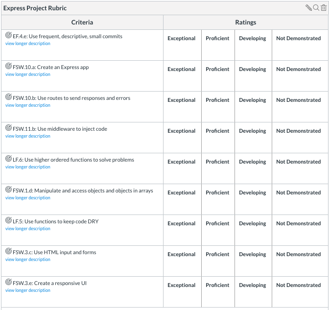

# Pursuit-Core-Web-Express-Project

## Introduction

In this lab you will be developing a server that stores data for a school, and a simple frontend. The school has the following data models:

- Classes
- Students

#### Classes

- We will be storing each individual class as a file on the server in the folder `/classes`. 
- To store files as json, check out the stack overflow post [here](https://stackoverflow.com/questions/33113125/save-a-json-file-to-server-in-express-node)
- The name of the class will match the name of the file. Example: Class physics will be stored as the file `/classes/physics.json`.
- The class file will be stored as a `.json` file extension. The data in it will be a JSON object.
- The JSON object will basically hold an array of students.
- This is how the file should look:

```javascript
{
  students: [
    { name: 'John', age: 30, city: 'NYC', grade: 75 },
    { name: 'Emily', age: 28, city: 'LA', grade: 80 }
  ]
}
```

#### Students
- Each student will be a JSON object that stores four data points:
  - name
  - age
  - city
  - grade
- The same student can exist in multiple classes.

## Routes & Functionality

#### Adding Students to a Class
```
GET localhost:3000/class/add/?class=physics&name=John&age=30&city=NYC&grade=75
```
- Create the class file if it doesn't already exist
- If file exists, add a new user object to the class file's array
- The GET request must pass all four data points for the user to store into the file
- If the student name already exists, UPDATE/REWRITE the students information with the new data passed

A successful response should look like:

```javascript
{ 
  added: { name: 'John', age: 30, city: 'NYC', grade: 75 }
  class: 'physics',
  timestamp: "YYYY, MM/DD HH:MM:SS"
}
```

An error response should look like:
```javascript
{ 
  error: 'Please fill out all the information for the student',
  timestamp: "YYYY, MM/DD HH:MM:SS"
}
```

#### List All Students in a Class

```
GET localhost:3000/class/list/?class=physics
```
- Check if the class file exists, if not give an error response
- If class file exists show the list of students

```javascript
{
  students: [
    { name: 'John', age: 30, city: 'NYC', grade: 75 },
    { name: 'Emily', age: 28, city: 'LA', grade: 80 }
  ],
  timestamp: "YYYY, MM/DD HH:MM:SS"
}
```

An error response should look like:
```
{ 
  error: 'Class physicslol doesn't exist.',
  timestamp: "YYYY, MM/DD HH:MM:SS"
}
```

#### List Failing Students

```
GET localhost:3000/class/listfailing/?class=physics
```
- Check if the class file exists, if not give an error response
- If class file exists show the list of students who are scoring less than 50

```javascript
{
  students: [
    { name: 'Bob', age: 30, city: 'MIA', grade: 49 }
  ],
  timestamp: "YYYY, MM/DD HH:MM:SS"
}
```

An error response should look like:
```
{ 
  error: 'Class physicslol doesn't exist.',
  timestamp: "YYYY, MM/DD HH:MM:SS"
}
```

#### List Students from a Specific City

```
GET localhost:3000/class/listfromcity/?class=physics&city=MIA
```
- Check if the class file exists, if not give an error response
- If class file exists show the list of students who are from the entered city
- If a city is passed that doesn't match any students, just pass an empty array of students

```
{
  students: [
    { name: 'Bob', age: 30, city: 'MIA', grade: 49 }
  ],
  timestamp: "YYYY, MM/DD HH:MM:SS"
}
```

An error response should look like:
```
{ 
  error: 'Class physicslol doesn't exist.',
  timestamp: "YYYY, MM/DD HH:MM:SS"
}
```

## Frontend

Build two separate forms, for using each of the different routes:


### Form 1: Add Student

Have text inputs for:

- class
- name
- age
- city
- grade

Have a button to submit the form to your server.  Display the response below the form.


### Form 2: List Students

Have inputs for:

- class
- city (optional)

Have a checkbox input for:

- Show Failing Students Only

Have a button to submit the form to your server.  Route and retrieve the appropriate information given your inputs.  Display the response below the form.

## Rubric


